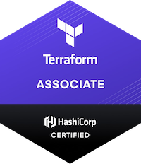

# Terraform Study Guide

Study Guide for the Terraform Associate Certification 2022

> Note: The project was originally forked from @ari_hack - Thanks for the great work!

  

## Objectives

- [x] 1. [Understand Infrastructure as Code (IaC) concepts](./docs/objectives/objective-1-2/Iac.md)
- [x] 2. [Understand Terraform's purpose (vs other IaC)](./docs/objectives/objective-1-2/Iac.md)
- [x] 3. [Understand Terraform basics](./docs/objectives/objective-3/terraform-basics.md)
- [x] 4. [Use the Terraform CLI (outside of core workflow)](./docs/objectives/objective-4/terraform-cli.md)
- [x] 5. [Interact with Terraform modules](./docs/objectives/objective-5/modules.md)
- [x] 6. [Navigate Terraform workflow](./docs/objectives/objective-6/workflow.md)
- [x] 7. [Implement and maintain state](./docs/objectives/objective-7/manage-state.md)
- [x] 8. [Read, generate, and modify the configuration](./docs/objectives/objective-8/hcl-features.md)
- [x] 9. [Understand Terraform Cloud and Enterprise capabilities](./docs/objectives/objective-9/cloud-and-enterprise.md)

---

## Additional Hashicorp Resources

- The exam will be on Terraform 1.0 and higher.
- [Exam Review](https://learn.hashicorp.com/terraform/certification/terraform-associate-review)
- [Official Study Guide](https://learn.hashicorp.com/tutorials/terraform/associate-study)
- [Lab Tutorials](https://learn.hashicorp.com/tutorials/terraform/infrastructure-as-code?in=terraform/aws-get-started)
- [Terraform Registry - Browse Providers | Modules](https://registry.terraform.io/)
- [Terraform Tutorials](https://learn.hashicorp.com/terraform?utm_source=terraform_io)

## Additional External Resources

- [🌟 Anki Flashcards](https://ankiweb.net/shared/info/180398604) 🌟
- [General Terraform Best Practices](https://www.terraform-best-practices.com/)
- [Terraform Cloud Interactive Learning](https://www.katacoda.com/courses/terraform)
- [A Cloud Guru Terraform Cheatsheet](https://res.cloudinary.com/acloud-guru/image/fetch/c_thumb,f_auto,q_auto/https://acg-wordpress-content-production.s3.us-west-2.amazonaws.com/app/uploads/2020/11/terraform-cheatsheet-from-ACG.pdf)

- Practice Exams

  - [Bryan Krausen (Paid) - Practice Questions (Udemy)](https://www.udemy.com/course/terraform-associate-practice-exam/)
  - [Medium (Free)](https://medium.com/bb-tutorials-and-thoughts/250-practice-questions-for-terraform-associate-certification-7a3ccebe6a1a)

  > NOTE: Most of this information comes directly from the [Hashicorp website](https://learn.hashicorp.com/terraform/certification/terraform-associate-study-guide) I've compiled the resources here for accessibility and easy review. 🙂 If you find this study guide useful please give it a 🌟 and check back for updates!
